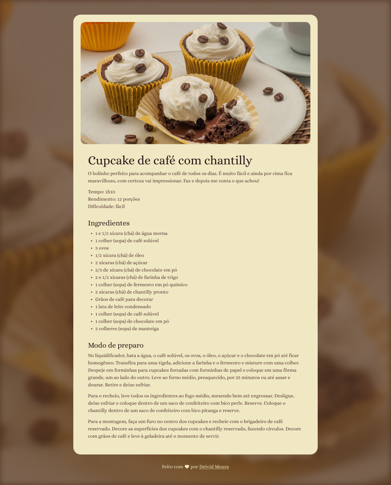

# 🧁 Página de Receita

Este é um projeto simples desenvolvido para praticar fundamentos básicos de CSS. Ele consiste em uma página HTML que exibe uma receita de cupcake com café e chantilly. O projeto utiliza apenas HTML e CSS, com imagens armazenadas na pasta `assets/images`.

## 📖 Visão Geral

A página apresenta uma receita detalhada de cupcakes, incluindo uma lista de ingredientes e um modo de preparo, além de informações sobre o tempo de preparo, rendimento e dificuldade.

## 🗂️ Estrutura do Projeto

```
|-- index.html        # Página principal do projeto
|-- assets/           # Pasta contendo os estilos e as imagens utilizadas
    |-- css/
        |-- style.css     # Arquivo de estilos CSS
    |-- images/
        |-- bg-image.jpg
        |-- main-image.jpg
        |-- heart.svg
        |-- demo.jpg
```

## 🔍 Como Visualizar

Para visualizar a página em seu navegador, siga estas etapas:

1. Faça o download ou clone este repositório:
   ```bash
   git clone https://github.com/DevDeividMoura/recipe-page.git 
   ```
2. Navegue para dentro do projeto:
   ```bash
   cd recipe-page
   ```
3. Abra o arquivo `index.html` em qualquer navegador para visualizar a página.

## 🖼️ Demonstração

Veja abaixo uma prévia da página final:



## 💻 Tecnologias Utilizadas

- **HTML**: Para estruturação semântica da página.
- **CSS**: Para estilização da página.

## 🎯 Objetivo

O objetivo principal deste projeto é praticar:
- Estruturação semântica de páginas HTML.
- Estilização básica com CSS.
- Organização de arquivos de projeto.
- Versionamento com Commits Convencionais.

## 🤝 Contribuições

Contribuições e sugestões são sempre bem-vindas! 😊

---

**Feito com ❤️ por [Deivid Moura](https://github.com/DevDeividMoura)**
